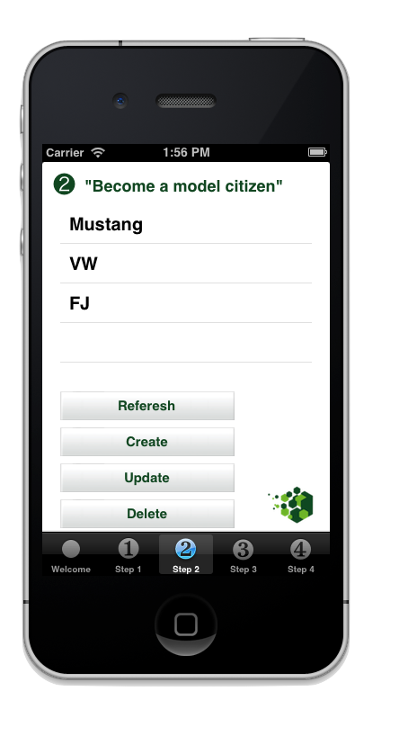

## Getting Started

Once you've got your LoopBack-powered backend running, it's time to integrate it
with your mobile application.

### Requirements

 * Mac OSX with [Xcode](https://developer.apple.com/) 4.6 or higher
 * LoopBack iOS SDK.
 * For on-device testing, an iOS device with iOS 5 or higher
 * A LoopBack-powered server application 

### Guided: Get Started with the Guide Application

The easiest way to get started with the LoopBack iOS SDK is with the LoopBack
iOS Guide Application. The Guide Application comes ready to compile with XCode,
and each Tab in the Application will guide you through the features available to
mobile applications through the SDK.





From your usual projects directory:

 1. Download the LoopBack Guide Application to your local machine from
 [GitHub](https://github.com/strongloop/loopback-ios-getting-started).

    ```sh
    git clone git@github.com:strongloop/loopback-ios-getting-started.git
    ```
 1. Open the Xcode project downloaded as a part of the Guide Application's
 Git repository.

    ```sh
    cd loopback-ios-getting-started\loopback-ios-app
    open loopback-ios-multi-model.xcodeproj
    ```

 1. Run the Application from Xcode (Command+R by default) and follow the
 instructions on each tab. Popup dialogs in the Application will ask you to
 uncomment various code blocks in each ViewController illustrating how to use
 the LoopBack SDK to interact with Models stored on the server.

### DIY: Get Started with the LoopBack SDK

If you are creating a new iOS application or want to integrate an existing
application with LoopBack you'll want to use the LoopBack SDK directly
(LoopBack.framework) independent of the Guide Application.

Once you have the StrongLoop 
installed and are ready to develop LoopBack applications (see
[Requirements](#requirements) for more information on what you'll need):

 1. Open the Xcode project you want to use with LoopBack, or [create a new one](https://developer.apple.com/library/ios/documentation/ToolsLanguages/Conceptual/Xcode_User_Guide/020-Start_a_Project/start_project.html).
 1. Open the SDKs folder of the distro:

    ```sh
    open /usr/local/share/strongloop-node/strongloop/sdks/loopback-ios-sdk
    ```
 1. Drag the entire LoopBack.framework folder from the new Finder window into
 your Xcode project.  **Important:** Make sure the "Copy items to destination's group folder"
checkbox is checked. This places a copy of the SDK within your application's
project folder.


 1. Verify LoopBack is included in the list of iOS Frameworks to link against
 your binary. In your Project settings, check the 'Link with Binaries' section
 under the 'Build Phases' tab. If it's missing, you can add it directly by
 clicking the '+' button and selecting LoopBack.framework.

    - If LoopBack.framework isn't displayed in the list, try the previous step
    again; Xcode didn't create the copy it was supposed to create.


 1. Import the LoopBack.h header into your application just as you would
 `Foundation/Foundation.h`:

    ```objectivec
    #import <LoopBack/LoopBack.h>
    ```


 1. Somewhere, we're going to need an Adapter to tell the SDK where to find our
 server:

    ```objectivec
    LBRESTAdapter *adapter = [LBRESTAdapter adapterWithURL:[NSURL URLWithString:@"http://example.com"]];
    ```

 This `LBRESTAdapter` provides the starting point for all our interactions
 with the running and anxiously waiting server.
 1. Once we have access to `adapter` (for the sake of example, we'll assume the
 Adapter is available through our AppDelegate), we can create basic `LBModel`
 and `LBModelRepository` objects. Assuming we've previously created [a model
 named "product"](http://docs.strongloop.com/loopback#model):

    ```objectivec
    LBRESTAdapter *adapter = [[UIApplication sharedApplication] delegate].adapter;
    LBModelRepository *productRepository = [adapter repositoryWithModelName:@"products"];
    LBModel *pen = [productRepository modelWithDictionary:@{ "name": "Awesome Pen" }];
    ```

    - All the normal, magical `LBModel` and `LBModelRepository` methods (e.g.
    `create`, `destroy`, `findById`) are now available through `Product` and
    `pen`!
 1. Go forth and develop! 
